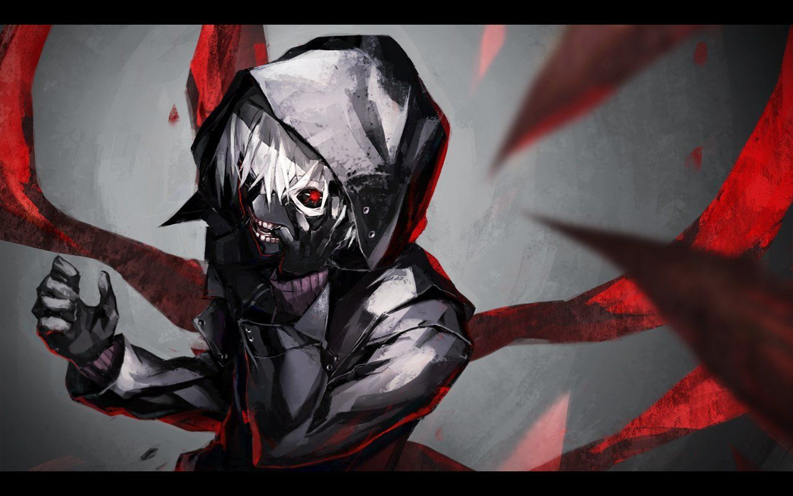
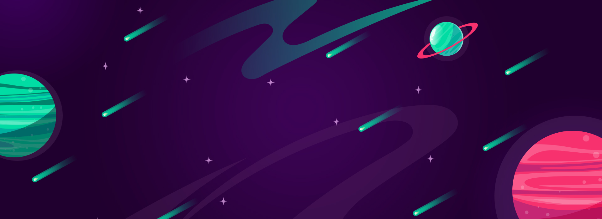

# Hey, I am Insane!! :wave:	

 

 

---

### :metal:	:metal: About Me :
* :v:	         Hello I am Insane,
* :pencil2:	   Currently preparing for JEE MAINS AND ADV,
* :blue_heart:	Learning programming, github, created a coding yt channel for helping ppls with my current level of knowledge 
* :dart:	      Diehard fan of CS and cant live without it

---

### :boom: :boom: I Can Do It :
* IIT BOMBAY CS IS MAH DREAM and I WILL ACHIEVE IT !! :crossed_swords:	

---

### :fire:	:fire:	Motivation :
* REMEMBER : Always Aim For Something Which You Are 100 per Sure That You Would Definitely Fail and Cant Get It, And Then TRY HARDER And HARDER And HARDER And Even More HARDER, And Make Sure To Get It, Until You Dont Get It :] :shield: 
* Always Aim Higher And Higher And Even More And Never Stop Grinding, Never Give Up, Proove Yourself, Keep Working Instead of Just Dreaming It and Saying It, You Can Do It, You   Have That Potential !!

---

### :memo: :memo: My Goals :

* ACADEMICS
  * JEE ADV AIR 1 AND WANT TO BE THE FIRST PERSON TO SCORE 100 PER MARKS IN ADV
  * 100 PER IN CLASS 12 BOARDS
  * DECENT MARKS IN CLASS 11 (CLASS 11 SCHOOL PART WENT A LITTLE HAYWIRE) :)
  * KVPY AIR 1 NEXT YEAR (2022)
  * CLEAR PRMO AND THEN SUCCESSIVE LEVELS

* NON - ACADEMICS
  * STARIGHT CS EXPERT
  * CSGO GLOBAL ELITE  
  * VALORANT RADIANT
  * NETWORKING IN MY HANDS

---

### :hotsprings: :hotsprings: Social Medias :
* YOUTUBE : https://www.youtube.com/channel/UC06S1t3dYo_NLdEF1_SQq9w
* INSTAGRAM : null
* FACEBOOK : null
* TWITTER : null

---

### :scroll:	:scroll:	Languages and Tools:

[][webdevplaylist]
[][webdevplaylist]
[][cssplaylist]
[][cssplaylist]
[][jsplaylist]
[][reactplaylist]
[][webdevplaylist]
[][webdevplaylist]
[][webdevplaylist]
[][webdevplaylist]
[][webdevplaylist]
[][webdevplaylist]
[][webdevplaylist]
[][webdevplaylist]
[][webdevplaylist]
[][webdevplaylist]

 
 

---

  
:zap: Recent GitHub Activity

  
<!--START_SECTION:activity-->
UHMM NOT MUCH TO DISPLAY RN xD
<!--END_SECTION:activity-->

  
:zap: GitHub Stats

<!--    -->
  

<!-- ### Stats -->
<!--  -->

---

### :ocean:	:ocean:	Cool BGs :
* BG-Image1

 

* BG-Image2

[website]: https://codeSTACKr.com
[course]: http://vsCodeHero.com
[twitter]: https://twitter.com/codeSTACKr
[youtube]: https://youtube.com/codeSTACKr
[instagram]: https://instagram.com/codeSTACKr
[linkedin]: https://linkedin.com/in/codeSTACKr
[webdevplaylist]: https://www.youtube.com/playlist?list=PLkwxH9e_vrAJ0WbEsFA9W3I1W-g_BTsbt
[jsplaylist]: https://www.youtube.com/playlist?list=PLkwxH9e_vrALRJKu7wfXby3MKeflhTu6B
[cssplaylist]: https://www.youtube.com/playlist?list=PLkwxH9e_vrALSdvZuEh6gqQdmDoDIoqz4
[reactplaylist]: https://www.youtube.com/playlist?list=PLkwxH9e_vrAK4TdffpxKY3QGyHCpxFcQ0
